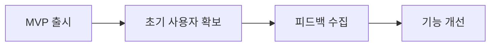

# 🚗 AutoZone.mn (Turbo.mn) - 프로젝트 소개

> **몽골 최대의 자동차 통합 플랫폼**  
> 중고차 매매 · 렌탈 · 부품/타이어 · 서비스 센터를 하나로

---

## 📋 목차

1. [프로젝트 개요](#-프로젝트-개요)
2. [핵심 가치](#-핵심-가치)
3. [주요 기능](#-주요-기능)
4. [기술 스택](#-기술-스택)
5. [수익 구조](#-수익-구조)
6. [비즈니스 전략](#-비즈니스-전략)
7. [로드맵](#-로드맵)

---

## 🎯 프로젝트 개요

### 소개

**AutoZone.mn**은 몽골 자동차 시장을 위한 올인원 디지털 플랫폼입니다. 사용자들이 중고차를 사고팔고, 렌탈하고, 부품과 타이어를 거래하며, 가까운 서비스 센터를 찾을 수 있는 통합 생태계를 제공합니다.

### 타겟 시장

- **1차 타겟**: 몽골 (울란바토르, 에르데네트, 다르항 등 주요 도시)
- **2차 타겟**: 몽골어/러시아어권 중앙아시아 지역 확장 가능

### 다국어 지원

| 언어 | 코드 | 상태 |
|------|------|------|
| 🇲🇳 몽골어 | `mn` | ✅ 완료 |
| 🇰🇷 한국어 | `ko` | ✅ 완료 |
| 🇺🇸 영어 | `en` | ✅ 완료 |

---

## 💎 핵심 가치

### 1. 🔒 신뢰성
- **차량 진단 시스템 (Carchex)**: AI 기반 차량 상태 분석
- **무사고 인증**: 차체 패널, 프레임, 도장 상태 검사
- **투명한 가격 분석**: 신차/수입가 대비 비교

### 2. ⚡ 편의성
- **빠른 검색**: 제조사/모델/예산/키워드 기반 검색
- **3단계 등급 시스템**: GOLD, SILVER, GENERAL
- **원스톱 서비스**: 구매 → 정비 → 보험까지 연결

### 3. 🌐 접근성
- **반응형 디자인**: 모바일/태블릿/데스크톱 지원
- **다국어 UI**: 몽골어, 한국어, 영어
- **지도 기반 서비스**: 가까운 서비스 센터 탐색

---

## 🚀 주요 기능

### 1. 🚙 차량 구매 (Buy)

```
/buy
├── /all          # 전체 차량 목록 (필터/정렬)
├── /motorcycle   # 오토바이
├── /tire         # 타이어/휠
└── /parts        # 부품/액세서리
```

**핵심 기능:**
- 고급 필터링 (제조사, 연식, 주행거리, 가격, 연료, 변속기, 색상, 지역)
- 차량 상세 페이지 (갤러리, 스펙, 옵션, 가격 분석)
- 즐겨찾기 & 최근 본 차량
- Carchex 차량 진단 (무사고 검증)
- 신차/수입가 대비 가격 비교

### 2. 📝 차량 판매 (Sell)

```
/sell
├── /car          # 자동차 등록
├── /motorcycle   # 오토바이 등록
├── /tire         # 타이어 등록
├── /parts        # 부품 등록
├── /rent         # 렌탈 차량 등록
└── /car-center   # 서비스 센터 등록
```

**등록 프로세스:**
1. 카테고리 선택
2. 기본 정보 입력 (제조사, 모델, 연식, 주행거리 등)
3. 사진/동영상 업로드 (최대 20장/500MB)
4. 상세 설명 작성
5. 플랜 선택 & 결제
6. 검토 후 게시

### 3. 🚘 차량 렌탈 (Rent)

```
/rent
├── /small   # 소형차 (경차, 세단)
├── /large   # 대형차 (SUV, MPV)
└── /truck   # 화물차
```

**렌탈 정보:**
- 일일 렌탈 가격
- 차량 상태 (연식, 주행거리)
- 위치 기반 검색
- 즉시 예약

### 4. 🔧 서비스 센터 (Service)

```
/service
├── /         # 센터 목록
└── /center/[id]  # 센터 상세
```

**서비스 유형:**
| 카테고리 | 설명 |
|----------|------|
| 엔진 수리 | 엔진 오버홀, 튜닝 |
| 타이어 서비스 | 교체, 휠 얼라인먼트 |
| 오일 교환 | 엔진오일, 미션오일 |
| 브레이크 | 패드, 디스크 교체 |
| 전기 | 배터리, 전장품 |
| 에어컨 | 냉매 충전, 수리 |

**센터 정보:**
- 운영시간/휴무일
- 서비스 메뉴 & 가격표
- Leaflet 지도 연동
- 전화 바로 걸기

### 5. 📰 미디어 (Media)

```
/media
├── ?tab=news   # 자동차 뉴스
├── ?tab=video  # 리뷰 영상
└── ?tab=event  # 이벤트/프로모션
```

### 6. 👤 마이페이지 (MyPage)

```
/mypage
├── 프로필 수정
├── 내 공고 관리 (등록/검토중/만료/거절)
├── 즐겨찾기 차량
├── 최근 본 차량
├── 알림 설정
└── 회원 탈퇴
```

---

## 🛠 기술 스택

### Frontend

| 기술 | 버전 | 용도 |
|------|------|------|
| **Next.js** | 16.1.1 | 풀스택 프레임워크 (App Router) |
| **React** | 19.2.3 | UI 라이브러리 |
| **TypeScript** | 5.x | 타입 안전성 |
| **Tailwind CSS** | 4.x | 스타일링 |
| **TanStack Query** | 5.90.12 | 서버 상태 관리 |
| **Leaflet** | 1.9.4 | 지도 (서비스 센터) |

### 아키텍처

```
src/
├── app/                    # Next.js App Router 페이지
│   ├── (auth)/             # 인증 (로그인, 회원가입)
│   └── (main)/             # 메인 레이아웃
│       ├── buy/            # 구매
│       ├── rent/           # 렌탈
│       ├── sell/           # 판매
│       ├── service/        # 서비스
│       ├── media/          # 미디어
│       └── mypage/         # 마이페이지
├── components/             # 재사용 컴포넌트
│   ├── ui/                 # 기본 UI (Button, Card, Dialog)
│   ├── cars/               # 차량 관련
│   ├── rent/               # 렌탈 관련
│   └── layout/             # 레이아웃 (Header, Footer)
├── context/                # React Context
│   ├── AuthContext.tsx     # 인증 상태
│   └── I18nContext.tsx     # 다국어
├── features/               # 도메인별 로직
├── i18n/                   # 번역 사전
├── lib/                    # 유틸리티
└── mock/                   # Mock 데이터
```

---

## 💰 수익 구조

### 1. 차량 등록 플랜 (B2C)

| 플랜 | 기간 | 가격 | 혜택 |
|------|------|------|------|
| **GOLD** | 30일 | ₮150,000 | 홈 상단 노출, 검색 우선순위 1위, GOLD 배지 |
| **SILVER** | 14일 | ₮70,000 | 홈 노출, 검색 우선순위 2위, SILVER 배지 |
| **GENERAL** | 7일 | 무료 | 기본 등록, 최근 목록 노출 |

### 2. 서비스 센터 등록 (B2B)

| 플랜 | 기간 | 가격 | 혜택 |
|------|------|------|------|
| **프리미엄** | 1년 | ₮2,000,000 | 상단 노출, 프로모션 배너, 리뷰 관리 |
| **스탠다드** | 6개월 | ₮800,000 | 기본 노출, 서비스 가격표 |
| **베이직** | 3개월 | ₮300,000 | 리스트 등록 |

### 3. 광고 수익

- **배너 광고**: 홈/목록 페이지 배너
- **프로모션 카드**: 검색 결과 내 스폰서 카드
- **이벤트/캠페인**: 브랜드 협업

### 4. 부가 서비스 (향후)

- **보험 연계**: 차량 보험 중개 수수료
- **금융 연계**: 할부/리스 연결 수수료
- **프리미엄 진단**: Carchex 정밀 진단 유료화

---

## 📈 비즈니스 전략

### Phase 1: 시장 진입 (현재)



**핵심 전략:**
- 무료 GENERAL 플랜으로 판매자 유입
- SEO 최적화로 오가닉 트래픽 확보
- SNS 마케팅 (Facebook, Instagram)

### Phase 2: 성장 (6-12개월)

**핵심 전략:**
- GOLD/SILVER 플랜 프로모션
- 서비스 센터 파트너십 확대
- 모바일 앱 출시 (iOS/Android)
- 결제 시스템 연동 (QPay, 카드)

### Phase 3: 확장 (1-2년)

**핵심 전략:**
- 보험/금융 서비스 연계
- B2B 딜러 전용 플랫폼
- 지역 확장 (에르데네트, 다르항)
- AI 가격 예측 시스템

### 경쟁 우위

| 요소 | AutoZone.mn | 경쟁사 |
|------|-------------|--------|
| 차량 진단 | ✅ Carchex 연동 | ❌ 없음 |
| 다국어 | ✅ 3개 언어 | ❌ 1개 |
| 통합 서비스 | ✅ 구매+렌탈+정비 | ❌ 단일 서비스 |
| 모던 UI/UX | ✅ 반응형 | ❌ 구형 |
| 가격 분석 | ✅ 신차/수입가 비교 | ❌ 없음 |

---

## 🗓 로드맵

### 2026 Q1 (현재)
- [x] MVP 프론트엔드 완성
- [x] 다국어 지원 (MN/KO/EN)
- [x] 차량 검색/필터링
- [x] 서비스 센터 지도 연동
- [ ] 백엔드 API 연동

### 2026 Q2
- [ ] 결제 시스템 (QPay, 카드)
- [ ] 사용자 인증 (OAuth)
- [ ] 푸시 알림
- [ ] 관리자 대시보드

### 2026 Q3
- [ ] 모바일 앱 (React Native)
- [ ] 채팅 기능 (판매자-구매자)
- [ ] 리뷰/평점 시스템

### 2026 Q4
- [ ] AI 가격 추천
- [ ] 보험 연계
- [ ] B2B 딜러 플랫폼

---

## 🚀 시작하기

### 설치

```bash
# 의존성 설치
npm install

# 개발 서버 실행
npm run dev

# 빌드
npm run build

# 프로덕션 실행
npm start
```

### 환경 변수 (향후)

```env
# .env.local
NEXT_PUBLIC_API_URL=https://api.autozone.mn
NEXT_PUBLIC_MAP_API_KEY=your_leaflet_key
DATABASE_URL=postgresql://...
```

---

## 📞 연락처

- **웹사이트**: [autozone.mn](https://autozone.mn)
- **이메일**: contact@autozone.mn
- **고객센터**: 평일 09:00 - 18:00

---

<div align="center">

**AutoZone.mn** - 몽골 자동차 시장의 새로운 기준 🚗

*Built with ❤️ using Next.js, React, and TypeScript*

</div>

